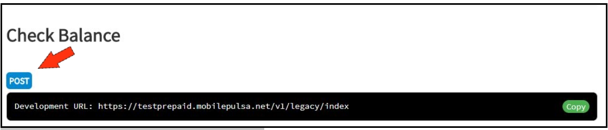

# Check Balance



### Parameter

| Field    | Type     | Description                           |
| -------- | -------- | ------------------------------------- |
| commands | string   | balance                               |
| username | string   | Your Registered Phone Number          |
| sign     | string   | Signature - md5(username+api_key+"bl")|

```json json_schema
{
  "type": "object",
  "properties": {
    "commands": {
      "type": "string",
      "description": "balance"
    },
    "username": {
      "type": "string"
    },
    "sign": {
      "type": "string",
      "description": "md5(username+api_key+'bl')"
    }
  }
}
```

### Request

<!--
type: tab
title: Request JSON
-->

```json
{
	"commands" : "balance",
	"username" : "087888067165",
	"sign"     : "51cf7677af84d08103400cf9abe208a7"
}
```

<!--
type: tab
title: Request XML
-->

```json
<?xml version="1.0" ?>
<mp>
    <commands>balance</commands>
    <username>087888067165</username>
    <sign>51cf7677af84d08103400cf9abe208a7</sign>
</mp>
```
<!-- type: tab-end -->

### Response Paramater

| Field    | Type     | Description |
| -------- | -------- | ----------- |
| balance  | Double   | Your Balance|


```json json_schema
{
  "type": "object",
  "properties": {
    "balance": {
      "type": "number"
    }
  }
}
```

### Success Response 

```json
{
	"data": {
		"balance": 997136249
	}
}
```

### Testing
<!--
type: tab
title: Development
-->

```json http
{
  "method": "post",
  "url": "https://testprepaid.mobilepulsa.net/v1/legacy/index"
}
```

<!--
type: tab
title: Production
-->

```json http
{
  "method": "post",
  "url": "https://mobilepulsa.net/v1/legacy/index"
}
```

<!-- type: tab-end -->
