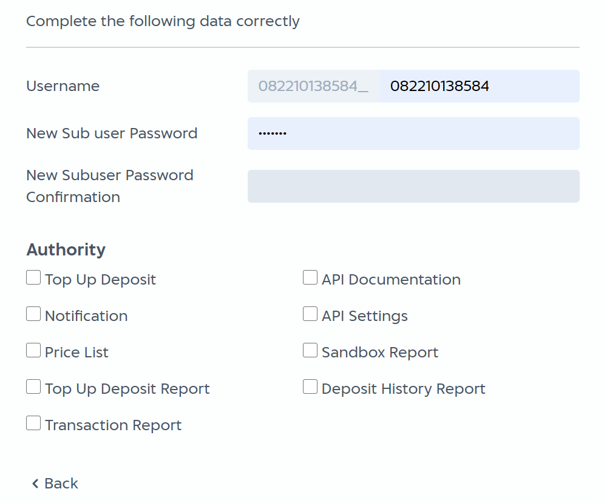

# User Management

When you [register](https://developer.mobilepulsa.net/signin) for IAK Account, then it will be your main account to IAK Service. With main account, you can create a sub user for your team with limited access.

## Adding Your Team

From the main account, you can add account for your team and define what access will be granted.
To add account, do the following steps.

  1. Go to [User Management](https://developer.mobilepulsa.net/user_management) in developer (nanti akan jadi iak.id).
  2. Input your main password following by new account password and new account password confirmation.
  3. Choose what access you want to grant from the list.

## Authority List

Here is the authority list that you can grant to your team.

Authority | Description
---------|----------
 Dashboard    | View transaction summary  
 Top Up     | Top up balance to IAK account
 Notification      | See IAK notification
 Price List   | View price list of IAK products
 API Setting  | Manage API setting for sandbox and production environment
 Report     | View and download transaction report 
 Sandbox Report | Access report in sandbox environment
 Custom Status Price List | Manage price list for IAK products  