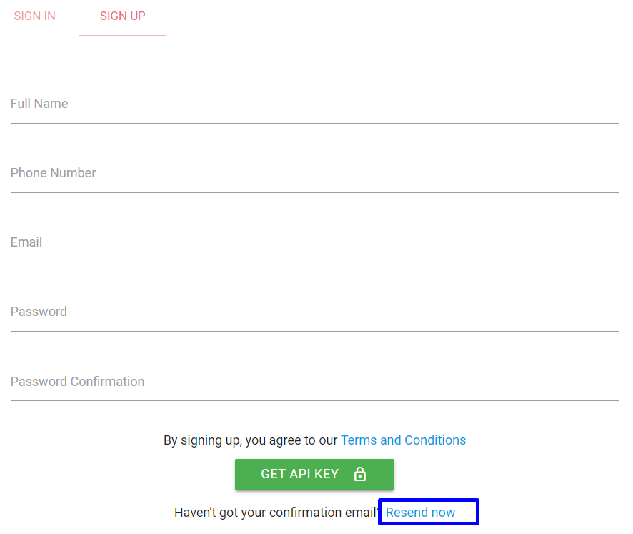

# FAQ

Below you will find answers to commonly asked questions.

<!-- theme: info -->

> Still have question? Contact us [now](mailto:techsupport@mobilepulsa.net)

## Registration

---

Q: How to register as API user?
  
A: To register as API user can be done [here](https://developer.mobilepulsa.net/signin#signup)

---

Q: I don't receive email varification

A: Make sure your email is valid. If you still don't receive verification email, in [https://developer.mobilepulsa.net/signin#signup](https://developer.mobilepulsa.net/signin#signup) click **Resend Now** button so we can resend verification to your email.

---

Q: Do you need to pay to register as API user?

A: No. Your can register freely. [Register now](https://developer.mobilepulsa.net/signin#signup).

---

## Change Account

---

Q: Can I change phone number?

A: No, you can [register](https://developer.mobilepulsa.net/signin#signup) again if you want change your phone number.

---

Q: Can I change email?

A: Yes, you can contact us at [techsupport@mobilepulsa.com](mailto:techsupport@mobilepulsa.com) to send letter of request.

---

## Report

---

Q: Can I view transaction history?

A: Yes you can view at **Report** menu [here](https://iak.id/webapp/report/prepaid) then choose the report type and filter that you want.

---

Q: Can I download report in PDF or Excel format?

A: Yes, after you click **PROCESS** button in **Report** menu [here](https://iak.id/webapp/report/prepaid) then you can choose download in PDF or Excel format.

---

## Sub User

---

Q: How to add sub user?

A: Yes, you can add sub user [here](https://iak.id/webapp/subuser) and choose the authority that you want to grant.

---

Q: Can I edit sub user data?

A: Yes, you can edit sub user [here](https://iak.id/webapp/subuser) and choose the sub user that you want to edit.

---

Q: Can I delete created sub user?

A: Yes, you can delete sub user [here](https://iak.id/webapp/subuser) and choose the sub user that you want to delete.

---

## API Setting

---

Q: Can one customer number do multiple transactions?

A: Yes, you can go to [iak developer](https://developer.mobilepulsa.net/production/ip) at **API Setting -> Production Settings** than activate **Allow multiple transactions for same number**. This permissoin allow the same customer number can do transaction more than once in a day to all denom. By default, customer number only can do one transaction per denom per day.

--- 

Q: How to allow API account to do transaction through web mobilepulsa.com?

A: You can go to [iak developer](https://developer.mobilepulsa.net/production/ip) at **API Setting -> Production Settings** than activate **API user can transaction on website mobilepulsa.com**.

---

Q: Can I restrict one customer number only can do one transaction to all denom in a day?

A: Yes, you can go to [iak developer](https://developer.mobilepulsa.net/production/ip) at **API Setting -> Production Settings** than activate **High restriction**. Permission **Allow multiple transactions for same number** won't be applied if you activate High restriction.

---

Q: Can I whitelist specific IP only to make transaction?

A: Yes, you can go to [iak developer](https://developer.mobilepulsa.net/production/ip) at **API Setting -> Production Settings** than deactivate **Allow transactions from any IP**. After that you can input your IP in **IP Whitelist** section.

--- 

Q: Can I open whitelist IP from any IP?

A: Yes, you can go to [iak developer](https://developer.mobilepulsa.net/production/ip) at **API Setting -> Production Settings** than deactivate **Allow transactions from any IP**.

<!-- theme: danger -->

> It is recommended to whitelist your IP from specific IP for security reason. Learn more [here](./security.md) about security.

---

## API Key

---

Q: Can I change API key?

A: No, but you can request the change and email us at [budiman@mobilepulsa.com](mailto:budiman@mobilepulsa.com) and cc to [techsupport@mobilepulsa.com](mailto:techsupport@mobilepulsa.com) than include the following as message:
  - username
  - schedule when to be changed

---

Q: How to get API key production?

A: First you must activate your account at [here](https://iak.id/webapp/production). After activate your account, you can go to [iak developer](https://developer.mobilepulsa.net/home) to get your production API key.

---

## Pricelist

---

Q: Where can I see digital products pricelist?

A: You can get pricelist [here](https://iak.id/webapp/pricelist) or through API. To get pricelist via API, read our docs [here](https://iak-api.stoplight.io/docs/api-reference/docs/introduction.md).

---

## Top Up Deposit

---

Q: How to top up balance?

A: You can top up balance from top up menu [here](https://iak.id/webapp/deposit/topup) -> fill the top up form -> there will appear the required data to transfer. Learn more [here](./topup-deposit.md).

---

Q: Can I top up balance via API?

A: No

---

Q: How to confirm top up deposit?

A: You can contact our customer service at 0817777215 or chat through freshchat.

---

Q: What is the time to top up?

A: At 07.00 AM - 09.00 PM, top up after 09.00 PM will be procceed next day.

--- 

Q: Can I do deposit withdrawal?

A: Yes, you can email to [budiman@mobilepulsa.com](mailto:budiman@mobilepulsa.com). We will refund after 7 days work time.

---

### Development Setting and Sandbox

---

Q: Can I do multiple actions in sandbox report?

A: No, only one action for one transaction.

---

Q: Where do callback sent in development?

A: You can set callback URL development at [iak developer](https://developer.mobilepulsa.net/development) than ffill callback URL than we will send callback response to your callback URL in development.

---

Q: Do I need to whitelist IP in development?

A: No, only in production that needed to whitelist IP.

---

Q: I received **Undefined Response** when call API. What can I do?

A: Usually undefined response given because of several reason. Make sure that:
  - URL is right and there is no **space** in the URL.
  - JSON / XML body is valid
  - Header is right. For JSON set header `Content-Type: application/json` and XML `Content-Type: application/xml`
Learn [here](https://iak-api.stoplight.io/docs/api-reference/docs/request.md) for API request.

---

## Prepaid API

---

Q: How long callback is sent in production?

A: Max 24 hours

---

Q: Can I auto detect operator when top up?

A: Yes but only for **pulsa** product type. You can use **pulsa[nominal]** as the product code. IAK will automatically detect the operator corresponding to customer number.
Learn [more](https://iak-api.stoplight.io/docs/api-reference/docs/prepaid%20v1%20(legacy)/core%20api/top%20up/auto-detect-operator.md) about auto detect operator.

---

Q: How can I get profit from prepaid transaction?

A: You can mark up the price as your profit margin.

---

## Postpaid API

---

Q: Can I use callback for postpaid?

A: No. You can use check status in postpaid. Learn [more](https://iak-api.stoplight.io/docs/api-reference/docs/postpaid/core%20api/check-status.md) about check status.

---

Q: How can I get profit from postpaid transaction?

A: For every postpaid transaction, you will get commission as your profit margin.

---

Q: How the commission is calculated?

A: Your deposit will be deducted based on the **selling_price** response field.

<!-- theme: info -->

> pulsa_price = transaction total that must be paid by end user
>
> selling_price = pulsa_price - commission

---

## Payment

---

Q: Can I do payment with settlement or only possible with the deposit?

A: Payment only can be done with deposit.

---

## Tax

---

Q: Will it be taxed every time I do deposit?

A: No, tax is based on transaction. If you need tax invoice contact us at [accounting@mobilepulsa.com](mailto: accounting@mobilepulsa.com).
