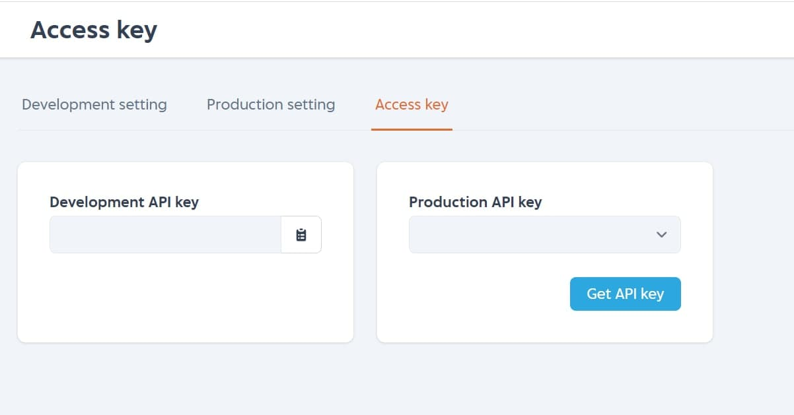

# API Key

API key is mainly used to connect with IAK API as an identifier. Without API key, you cannot connect with IAK API. 

There are 2 types of API key:
  1. API Key Sandbox (For sandbox environment)
  2. API Key Production (For production environment)
      
      To get API key production, you need to fill the **OTP code**

<!-- theme: info -->

> Get your API Key [here](https://developer.mobilepulsa.net/home)

<!-- theme: danger -->

> **Always keep your API Key confidential.**

