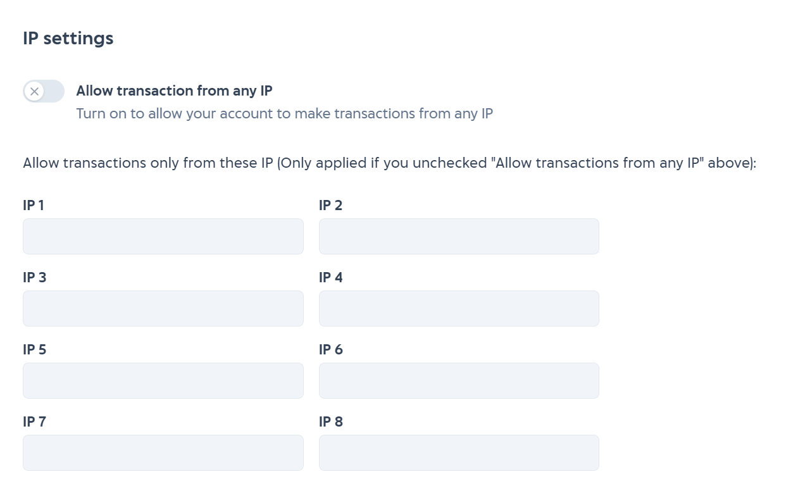

# Quick Start

Here's a quick start to integrate into our service : 

1. Get API Key

    To connect with our API, you need API key as identifier. There are 2 types of API key:

      1. API Key Sandbox (For sandbox environment)
      2. API Key Production (For production environment)

    Get your API key [here](https://developer.mobilepulsa.net/home)

2. Read API Reference

    Start to explore our documentation to integrate with our products.

    [Read the docs](docs/api-reference/docs/introduction.md)

3. Testing sandbox

    While do integration in sandbox environment, you can see sandbox report to monitor the sandbox transaction.

    

    For **prepaid** products, you must manually change the transaction status to success or failed in sandbox report. But in production environment, you don't need to manually change the transaction status because we are the one who will update the status manually through callback URL.

    

4. Whitelist IP

    In sandbox environment you don't need to whitelist IP but when it in production environment, you need to whitelist IP so our service can allow your account to do real transaction from your whitelist IP and deny outside whitelist IP.

    

<!-- theme: warning -->

> ### Watch Out!
> Actually you can allow transaction from any IP but if you use this option, any person from any IP can use your 
> account if they know your API KEY. We suggest you to use whitelist IP and input your IP for security reason.

5. Set Callback URL

    In **prepaid** product, we will send you a response to your callback URL to inform you about the prepaid transaction you did before. 
    There are only two possible response that we will send to your callback url:

   1. Success
   2. Failed

    Set your callback URL for [sandbox](https://developer.mobilepulsa.net/development) and [production](https://developer.mobilepulsa.net/production/ip).

<!-- theme: info -->

> Learn [here](./../security.md) to secure your callback URL.

6. Topup Deposit

    After you integrate your web or apps into our API, you need to topup deposit. We will deduct your deposit based on the price.

    Learn [here](./../topup-deposit.md) how to topup.

7. Call Production API

    Now you are ready to call API in production environment. To switch between sandbox and production you only need do the following:

   1. Change base URL from sandbox to production
      Learn here about base URL [prepaid](docs/api-reference/docs/prepaid%20v1%20(legacy)/base-url.md) and [postpaid](docs/api-reference/docs/postpaid/base-url.md).

   2. Change API key from sandbox to production
      Get your API key [here](https://developer.mobilepulsa.net/home)

8. See Report

    After doing real transaction via production environment, you can see the report for finance needs.

    [See report](https://iak.id/webapp/report/prepaid)

---

  **Question?** See our [FAQ](docs/developer-documentation/docs/faq.md) or contact us at [techsupport@mobilepulsa.com](mailto:techsupport@mobilepulsa.com)
