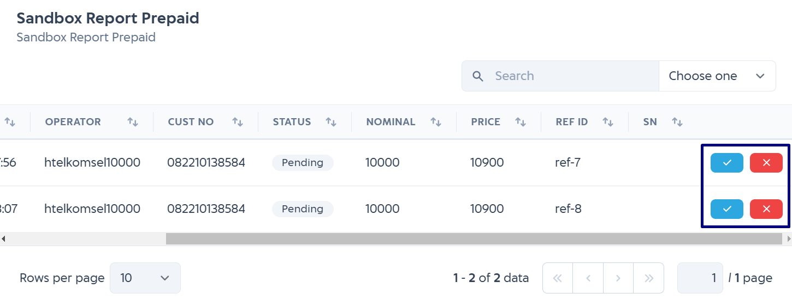
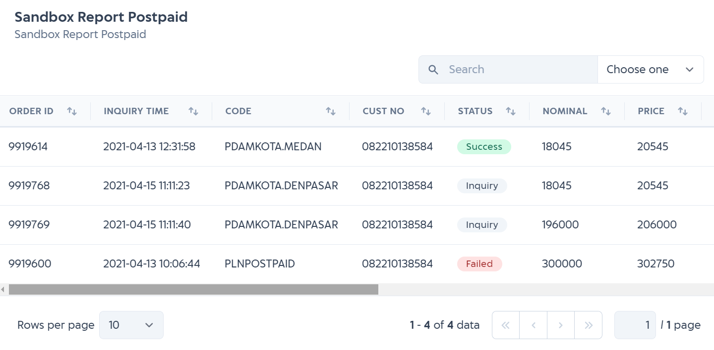

# Sandbox Report

While do integration in sandbox environment, you can see report in sandbox environment to see the sandbox transaction details.
Sandbox report is usefull when you are integrating with our service so you can see the transaction status.

You can access sandbox report from [here](https://developer.iak.id/sandbox-report).

  

## Prepaid

### Change Transaction Status

For **prepaid** products, you must manually change the transaction status to success or failed in sandbox report. But in production environment, you don't need to manually change the transaction status because we are the one who will update the status manually through callback URL.

When you click **SUCCESS** button, the transaction will become success and when you click **FAILED** button, the transaction will become failed. 
Everytime you change the transaction status by clicking the button, IAK will send response to your development callback URL according to the status of transaction. 

## Postpaid

In postpaid, sandbox report can be used to see the transaction details like status, price, admin, selling price, etc.
You cannot change the status manually like prepaid, in postpaid sandbox report you only can see the transaction detail.

