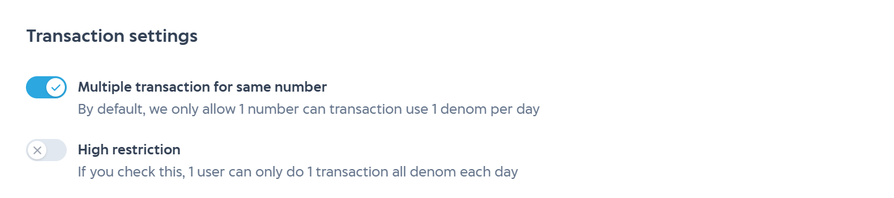

# Transaction Restriction

IAK API enables you to control the behavior of your transaction so you can put some limitation to the transaction. There are 2 limitation that you can set :

  1. Allow multiple transactions for same number
  2. High restriction

### Allow multiple transactions for same number

If you want to make your account only can **allow 1 number can transaction use 1 denom per day** you can **deactive** this feature. 

<!-- theme: info -->

> ### Here's an example
>
> 12345678901 is a pln meter number and do topup for denom 100000. For the rest of the day, 12345678901 cannot do
> topup pln denom 100000 again untill the next day (after 00.00 AM). If 12345678901 do top up for pln denom 100000, 
> then our API will give response code 202 with message **MAXIMUM 1 NUMBER 1 TIME IN 1 DAY**. 12345678901 pln number > still can do topup for another denom. 
>
> See [here](docs/reference/docs/prepaid%20v1%20(legacy)/response-code.md) for list response code.

### High Restriction

With high restriction, you can restrict more strictly. If you **activate** high restriction, your account only can **allow 1 number can only do 1 transaction all denom per day**.

> ### Here's an example
>
> The scheme is exactly like Allow multiple transactions for same number above. But if 12345678901 already do top up,> then 12345678901 number cannot do transaction again with any denom and any products.
>
> See [here](docs/reference/docs/prepaid%20v1%20(legacy)/response-code.md) for list response code.