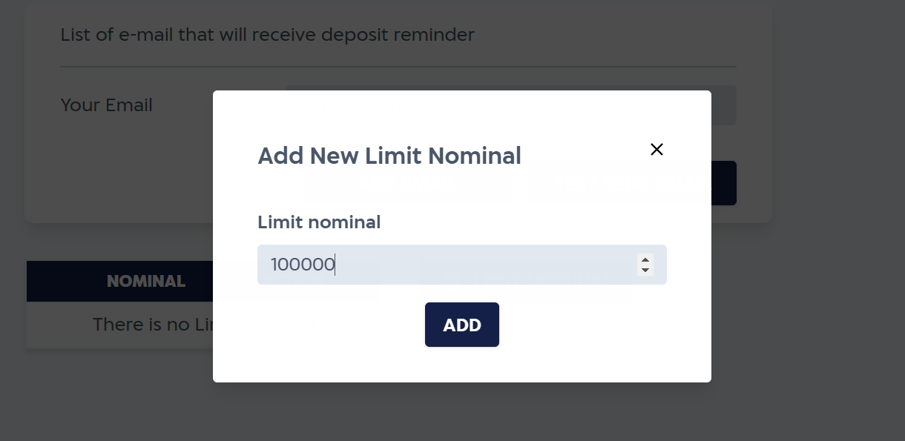
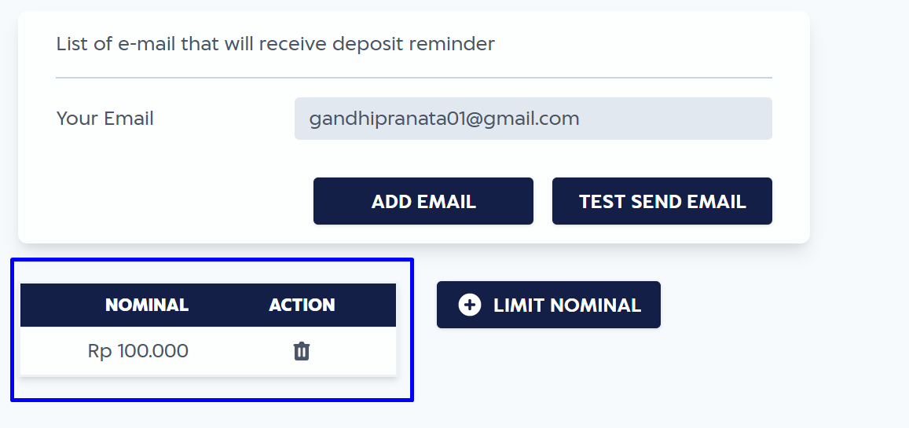

# Deposit Limit Reminder

IAK provide deposit limit reminder so you can get notified when your deposit is below some point. You can specify the treshold when IAK will send reminder to your email. 

## Set Limit Reminder

You can set the deposit limit reminder [here](https://iak.id/webapp/reminders).
There is a minimum amount that you can set is 10000 IDR.

In this example, you will receive email from IAK when your deposit is below 100000 IDR. 

<!-- theme: info -->

> ### A thing to know
>
> IAK only send reminder at **09.00 AM, 12.00 PM, 03.00 PM, 06.00 PM, and 09.00 PM GMT+7**
> when your deposit is below the treshold.

## Delete Limit Reminder

You also can delete the deposit limit reminder if you don't want to get notified again.

