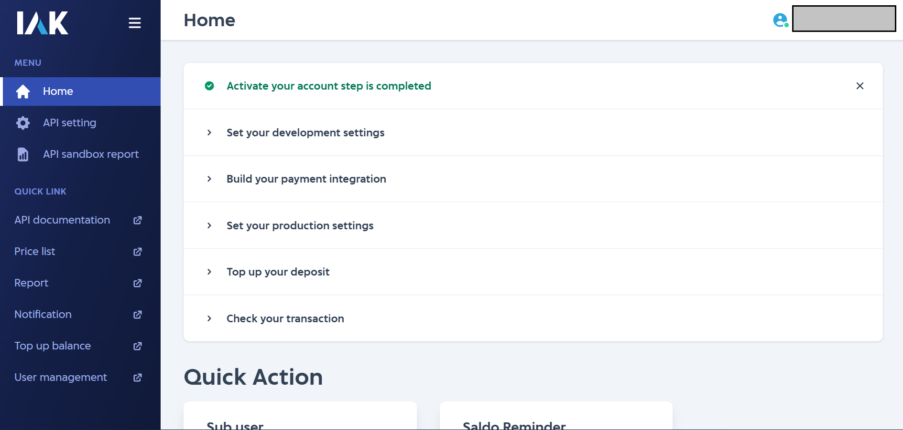
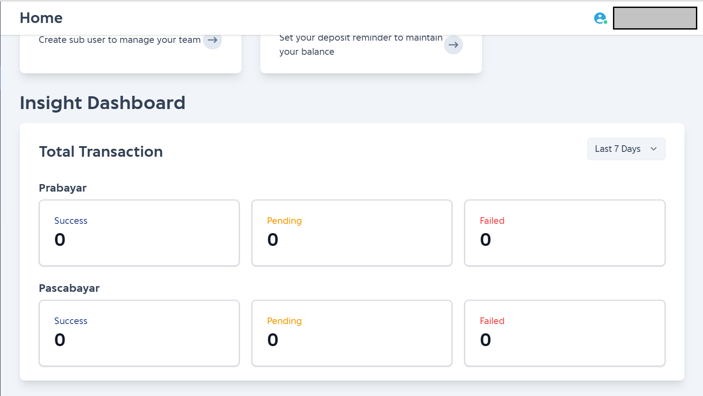
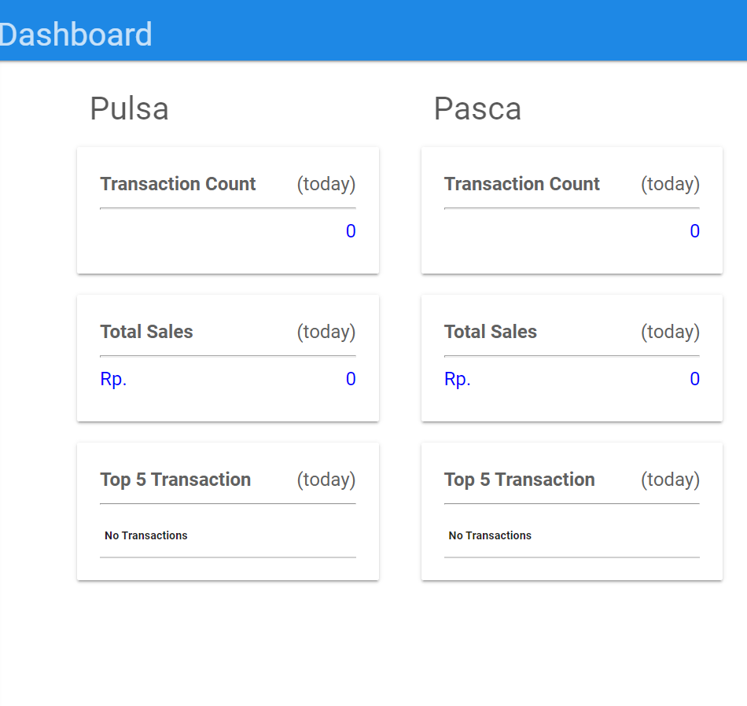
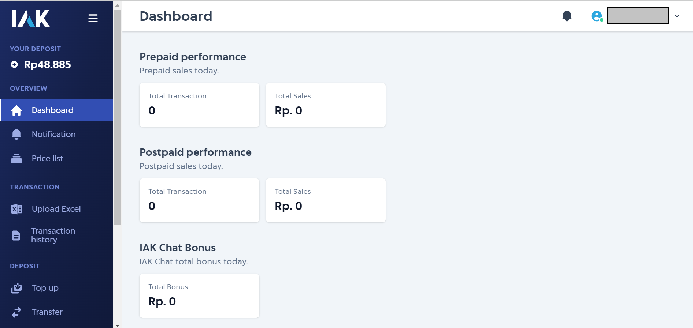
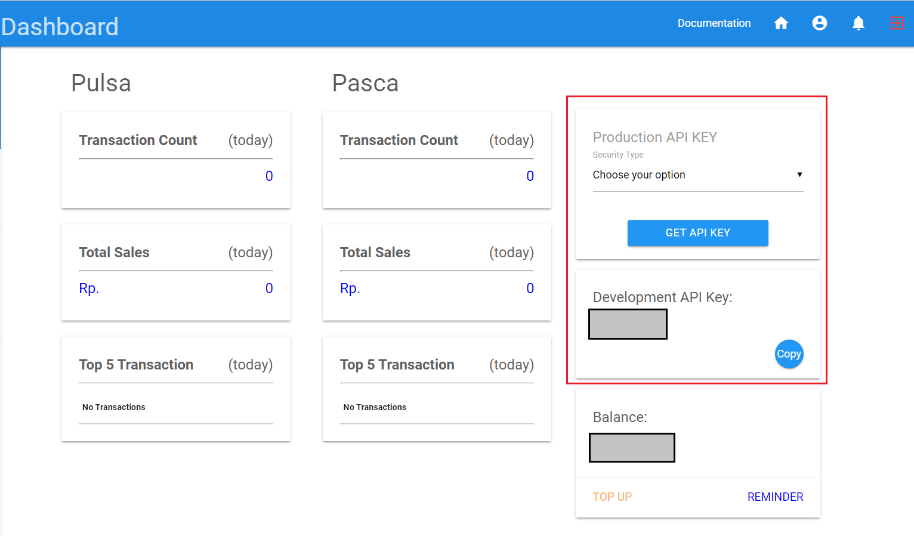
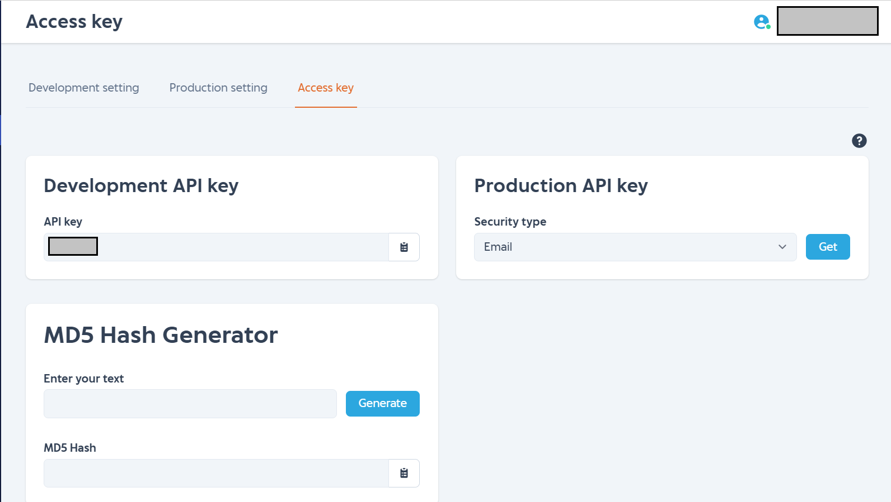

# Moving From Old to New Developer Site 

We have launched newly designed developer site that is https://developer.iak.id
Our old site (https://developer.mobilepulsa.net) soon will be un-maintained so make sure you use our new site.

We have 2 domains for new website, that is https://developer.iak.id and https://iak.id
See [here](./getting-started.md) for more information about different between those two website.

## What's the difference

In order to moving from old site (https://developer.mobilepulsa.net) to new site (https://developer.iak.id) there are several change that you can use as guide:

Page | Old | New
---------|----------|---------
 [Home](#home) | https://developer.mobilepulsa.net/home | https://developer.iak.id/home
 [API Key](#api-key) | https://developer.mobilepulsa.net/home | https://developer.iak.id/access-key
 Top up balance | https://developer.mobilepulsa.net/top_up | https://iak.id/webapp/top-up
 [Documentation](#documentation) | https://developer.mobilepulsa.net/documentation | https://api.iak.id
 Sandbox Report | https://developer.mobilepulsa.net/sandbox | https://developer.iak.id/sandbox-report
 User Information | https://developer.mobilepulsa.net/user_information | https://iak.id/webapp/setting/production
 Development Setting | https://developer.mobilepulsa.net/development | https://developer.iak.id/dev-setting
 Production Setting | https://developer.mobilepulsa.net/production/ip | https://developer.iak.id/prod-setting
 Deposit Limit | https://developer.mobilepulsa.net/production/depositLimit | https://iak.id/webapp/reminders
 Notification | https://developer.mobilepulsa.net/webapp/notifikasi | https://iak.id/webapp/notification
 Report | https://developer.mobilepulsa.net/report | https://iak.id/webapp/report/prepaid
 Price List | https://developer.mobilepulsa.net/price_list | https://iak.id/webapp/price-list/pulsa
 User Management | https://developer.mobilepulsa.net/user_management | https://iak.id/webapp/setting/sub-user
 Account | https://developer.mobilepulsa.net/account | https://iak.id/webapp/setting/profile
 Change Password | https://developer.mobilepulsa.net/password | https://iak.id/webapp/setting/change-password

### Home

#### New Guideline
In new developer home page, we provided some guide line for new user to complete the task needed before to use API untill production mode.

 
#### Dashboard
We provided new insight dashboard so you can have insight for the transaction more detailed.

You can also see dashboard that appear in old site (**Transaction Count and Total Sales**) at https://iak.id/webapp/dashboard

### API Key
In old developer, API key development and production appear at https://developer.iak.id/home

In new developer, API key appear at https://developer.iak.id/access-key

### Documentation
We have made some improvement to our documentation such as adding how to use developer web and SDK documentation meanwhile our old documentation only contain API documentation. We have 3 Sub menu new documentation:
 
 1. API Reference
This is the main api documentation (replacing the old one in https://developer.mobilepulsa.net/documentation)

 2. Developer Platform
 This documentation is for general use of https://developer.iak.id

 3. SDK Reference
 This is docuemntation for our SDK. You can see more detail there for supported programming language for the SDK.
