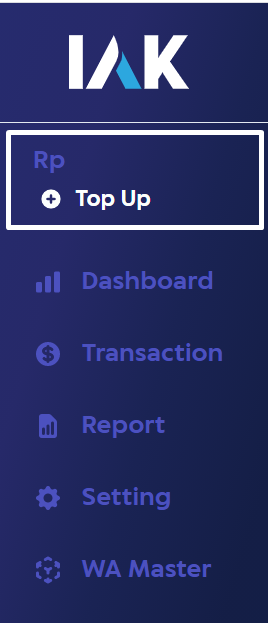
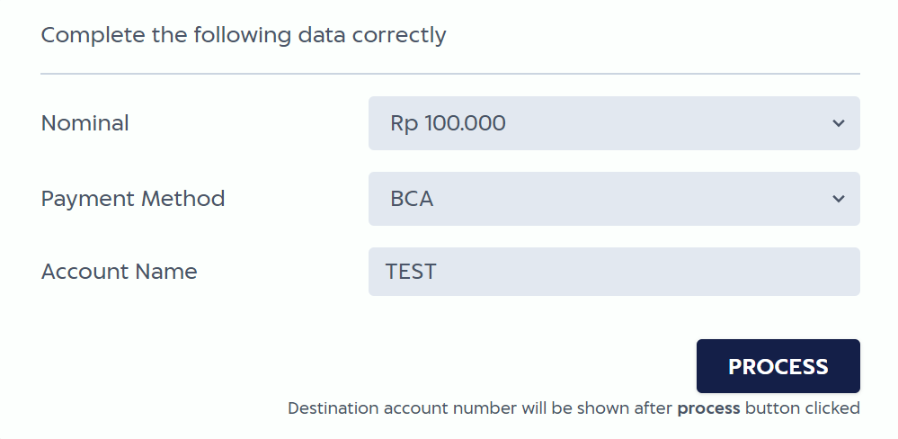
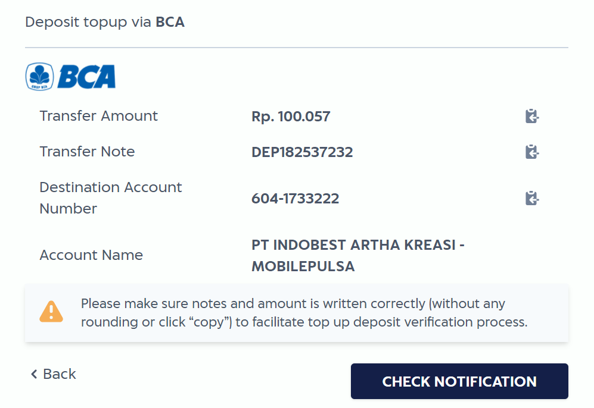
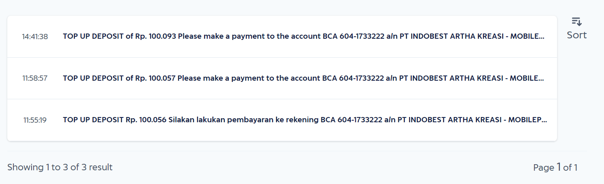

# Topup Deposit

In order to do real transaction in production environment, you need to topup deposit. Every transaction in production environment will deduct your balance in IAK wallet. 
You can also set reminder [here](./limit-reminder.md) when deposit amount below certain level. 

Here's a step how to topup deposit in iak:

## Go To Topup Menu

Login to [iak.id](https://auth.iak.id) and go to [Top Up](https://iak.id/webapp/deposit/topup) menu.

## Complete the data in Top Up menu

To do topup deposit, first you must complete the topup form.

### Nominal rules

The minimum nominal you can top up is 100.000 IDR. By default you only can top up with multiple of 100.000. The maximum amount you can top up is 1.000.000 IDR. But if you want to freely input the top up nominal, you can contact our team so we can give you free input nominal permission.

[Contact us](mailto:techsupport@mobilepulsa.com)

### Payment methods

We provide the following payment methods:
- BCA
- Mandiri
- BNI
- BRI   

## Transfer deposit

You will be directed to topup confirmation after completing the topup form. To complete the topup deposit, you must transfer with the detailed from topup confirmation.

<!-- theme: info -->
 
> ### Notes
>
> Please make sure include **Transfer Note** as remark and **Transfer Amount** exactly without **rounding**.
> Deposit payments above 21.00 GMT +7 will be processed on the next day.

## Transfer Notification

You can see in the [notification](https://iak.id/webapp/notification) for all of transfer detail that need to be done.

   