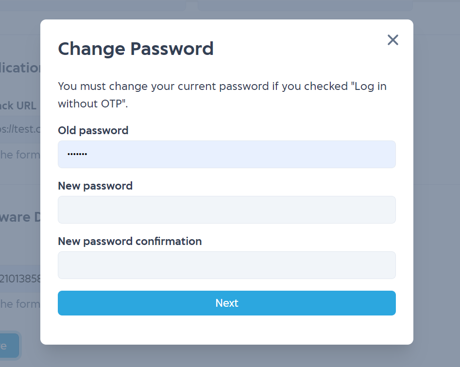

# Web Transaction

IAK provide web transaction that can accessed at [mobilepulsa.com](https://mobilepulsa.com). With web transaction, you can do purchase our prepaid or postpaid product through web.
To use this feature, you can set in [api setting](https://developer.mobilepulsa.net/production/ip).

## API user can transaction on website mobilepulsa.com

When you activate this feature, your account can be used to purchase IAK products at web [mobilepulsa.com](https://mobilepulsa.com).

## API can log in on website mobilepulsa.com without OTP

When you activate this feature, you don't need to input OTP when login to [mobilepulsa.com](https://mobilepulsa.com). But it is recomended to activate this feature to strengthen the security.

<!-- theme: info -->

> When deactive this feature, if your deposit is below 20 millions IDR, then its required for you to change your
> password. **The new password cannot be the same as the old one**.
>
> 